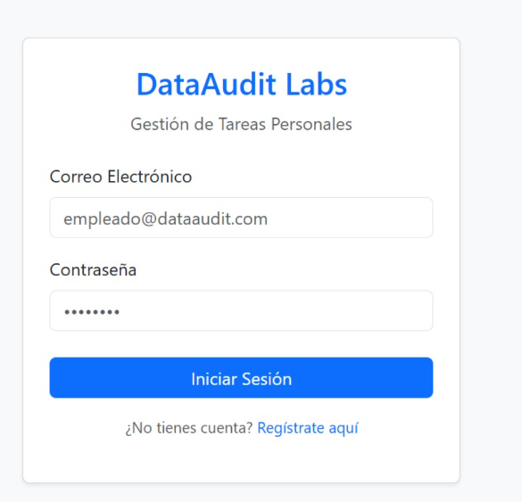
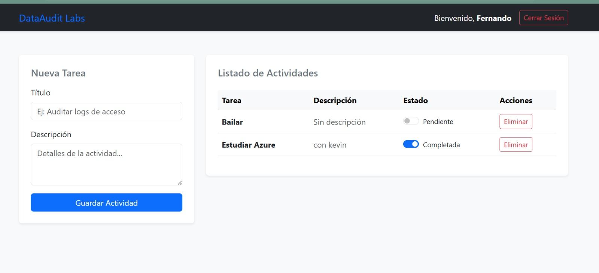
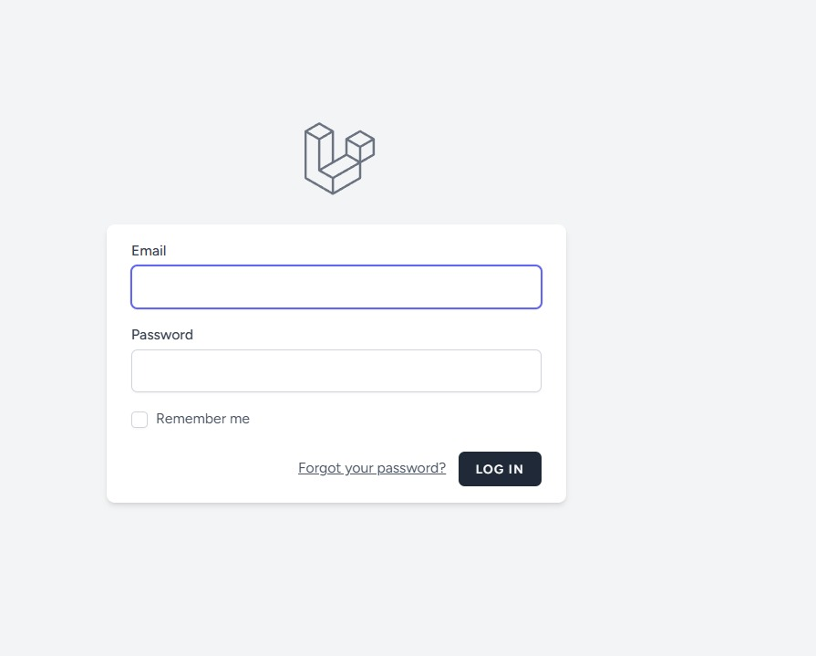
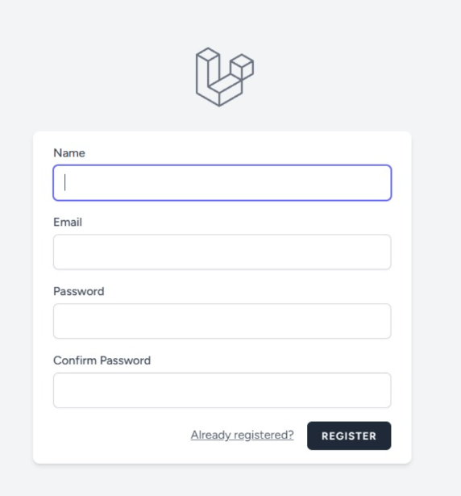
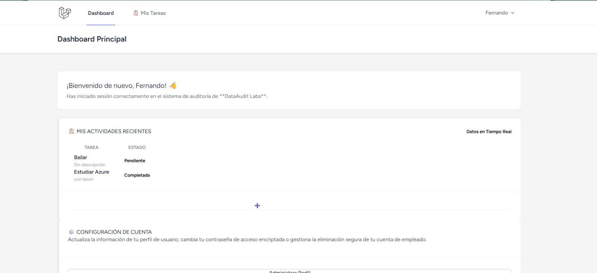
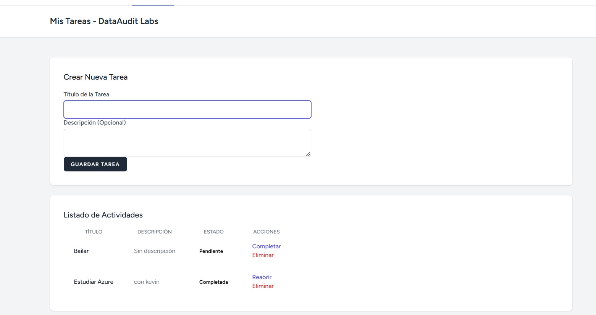

# DataAuditLabs - Sistema Web de Gestión de Tareas.

# Autores Proyecto desarrollado por: 

- **Josué Gabriel Vásquez Echegoyen** 
- **Fernando Aldair Duran Amaya**

## Descripción del proyecto DataAuditLabs es una aplicación web desarrollada para la gestión de tareas personales y organizadas dentro de una empresa. El sistema permite registrar usuarios, iniciar sesión y administrar tareas de manera segura y eficiente. 

---

# Funcionalidades principales

## MVC Nativo (PHP) 

- Registro de usuarios 
- Inicio y cierre de sesión 
- CRUD completo de tareas 
- Validación de formularios 
- Protección mediante sesiones 
- Gestión de tareas por usuario 
- Arquitectura MVC en PHP puro 

## AJAX 

- Cambio de estado de tareas sin recargar la página 
- Actualización dinámica de información ## Laravel 
- CRUD de tareas desarrollado con Laravel 
- Integración con MySQL 

---

# Tecnologías utilizadas

| Tecnología | Uso |
|------------|------|
| PHP | Backend |
| MySQL | Base de datos |
| Laravel | Framework |
| HTML5 | Estructura |
| CSS3 | Diseño |
| AJAX | Actualización dinámica |
| JavaScript | Funcionalidad |

--- 

# Declaración de uso de Inteligencia Artificial

| Herramienta | Parte del proyecto | Tipo de ayuda | ¿Entiende el código? |
|-------------|-------------------|----------------|----------------------|
| ChatGPT | README.md | Estructura y documentación | Sí |
| ChatGPT | MVC PHP | Explicación del patrón MVC | Sí |
| ChatGPT | Laravel | Resolución de dudas y ejemplos | Sí |
| ChatGPT | AJAX | Depuración y explicación | Sí |

Declaramos que todo el código entregado ha sido comprendido, revisado y modificado cuando fue necesario, y que podemos explicar su funcionamiento durante la defensa.

## Firmas

Josué Gabriel Vásquez Echegoyen

Fernando Aldair Duran Amaya

---

# Base de datos

1. Abrir XAMPP. 
2. Iniciar Apache y MySQL. 
3. Entrar a phpMyAdmin. 
4. Crear una nueva base de datos. 
5. Importar el archivo `.sql` del proyecto. 
6. Configurar las credenciales de conexión en el proyecto.

Usuario: root
Contraseña:

Archivo SQL:

---

# Capturas del proyecto

## Login - MVC Nativo



---

## Gestión de tareas - MVC Nativo



---

## Login - Laravel



---

## Registro - Laravel



---

## Dashboard - Laravel



---

## Gestión de tareas - Laravel



---

# Ejecutar MVC Nativo

1. Clonar el repositorio: git clone https://github.com/fershiiii/PARCIAL3DSS.git
2. Colocar la carpeta dentro de htdocs.
3. Iniciar Apache y MySQL desde XAMPP.
4. Importar el archivo SQL en phpMyAdmin.
5. Abrir el navegador en: http://localhost/PARCIAL3DSS-master/mvc_nativo/

---

# Ejecutar Laravel

1. Entrar a la carpeta:

```bash
cd laravel_tareas
````

2. Instalar dependencias:

```bash
composer install
```

3. Instalar Breeze:

```bash
composer require laravel/breeze --dev
```

4. Instalar Breeze:

```bash
php artisan breeze:install
```

5. Instalar dependencias de Node:

```bash
npm install
```

6. Compilar assets:

```bash
npm run dev
```

7. Configurar archivo `.env`

8. Generar clave:

```bash
php artisan key:generate
```

9. Ejecutar migraciones:

```bash
php artisan migrate
```

10. Iniciar servidor:

```bash
php artisan serve
```

---

# Repositorio Oficial 
Puede acceder al código fuente completo del proyecto en el siguiente enlace: 🔗 https://github.com/fershiiii/PARCIAL3DSS.git